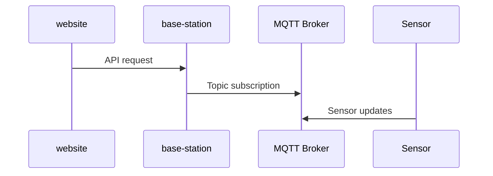

# Architecture

## System elements

```mermaid
sequenceDiagram;
    participant ws as website;
    participant bs as base-station;
    participant br as MQTT Broker;
    participant sen as Sensor;
    
    ws->>bs: API request;
    bs->>br: Topic subscription;
    sen->>br: Sensor updates;
```
